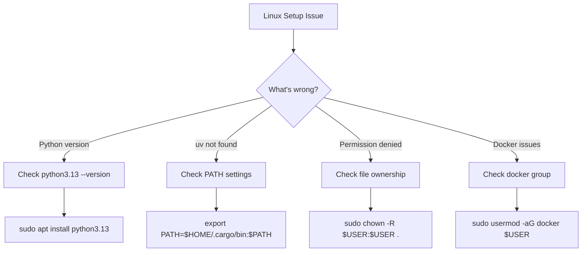

# Team Onboarding & Python 3.13/uv Best Practices Guide (Linux MVP)

## Quick Start Onboarding (< 15 minutes for Linux)

### 1. Interactive Onboarding Script

```python
#!/usr/bin/env python3
# scripts/onboard.py
"""Linux-optimized onboarding wizard for MVP development"""

import subprocess
import sys
import time
from pathlib import Path
import platform
import shutil
from typing import Tuple, List
import os

class LinuxOnboardingWizard:
    """Streamlined Linux developer setup"""

    def __init__(self):
        self.start_time = time.time()
        self.checks_passed = []
        self.issues = []

    def run(self):
        """Run the Linux onboarding process"""
        self.print_welcome()

        steps = [
            ("Linux System Check", self.check_linux_system),
            ("Docker Check", self.check_docker),
            ("Python 3.13 Setup", self.check_python),
            ("uv Installation", self.check_uv),
            ("Project Setup", self.setup_project),
            ("Tools Verification", self.verify_tools),
            ("Architecture Validation", self.validate_architecture),
            ("Quick Start Guide", self.show_quickstart)
        ]

        for step_name, step_func in steps:
            print(f"\n📍 {step_name}...")
            success, message = step_func()
            if success:
                self.checks_passed.append(step_name)
                print(f"   ✅ {message}")
            else:
                self.issues.append((step_name, message))
                print(f"   ⚠️  {message}")
                if not self.offer_fix(step_name):
                    break

        self.print_summary()

    def print_welcome(self):
        """Print welcome message"""
        print("=" * 60)
        print("🐧 Linux MVP Development Environment Setup")
        print("=" * 60)
        print("\nOptimized for Linux deployment.")
        print("Expected time: < 15 minutes\n")

        name = input("Developer name: ")
        print(f"\nWelcome, {name}! Setting up your Linux environment.\n")

    def check_linux_system(self) -> Tuple[bool, str]:
        """Verify Linux system requirements"""
        if platform.system() != "Linux":
            return False, "This setup is Linux-only for MVP"

        # Check Linux distribution
        try:
            with open('/etc/os-release') as f:
                os_info = f.read()
                if 'Ubuntu' in os_info or 'Debian' in os_info:
                    distro = "Ubuntu/Debian"
                elif 'Alpine' in os_info:
                    distro = "Alpine"
                else:
                    distro = "Generic Linux"

            # Check architecture
            arch = platform.machine()
            if arch in ["x86_64", "aarch64"]:
                return True, f"{distro} {arch} verified"
            else:
                return False, f"Unsupported architecture: {arch}"
        except:
            return True, "Linux system detected"

    def check_docker(self) -> Tuple[bool, str]:
        """Check Docker installation for containerized development"""
        if shutil.which("docker"):
            result = subprocess.run(
                ["docker", "--version"],
                capture_output=True,
                text=True
            )
            if result.returncode == 0:
                return True, f"Docker {result.stdout.strip()}"
        return False, "Docker not found (optional but recommended)"

    def check_python(self) -> Tuple[bool, str]:
        """Check Python 3.13 installation"""
        try:
            result = subprocess.run(
                ["python3", "--version"],
                capture_output=True,
                text=True
            )
            version = result.stdout.strip()

            if "3.13" in version:
                return True, f"Python {version} found"
            else:
                return False, f"Python 3.13 required, found {version}"
        except:
            return False, "Python not found"

    def check_uv(self) -> Tuple[bool, str]:
        """Check uv installation"""
        if shutil.which("uv"):
            result = subprocess.run(
                ["uv", "--version"],
                capture_output=True,
                text=True
            )
            return True, f"uv {result.stdout.strip()} installed"
        else:
            # Offer to install
            print("\n   uv not found. Installing...")
            return self.install_uv()

    def install_uv(self) -> Tuple[bool, str]:
        """Install uv package manager on Linux"""
        try:
            # Linux-specific installation
            subprocess.run(
                ["sh", "-c", "curl -LsSf https://astral.sh/uv/install.sh | sh"],
                check=True
            )
            # Add to PATH for current session
            os.environ["PATH"] = f"{os.environ['HOME']}/.cargo/bin:{os.environ['PATH']}"
            return True, "uv installed successfully"
        except:
            return False, "Failed to install uv"

    def setup_project(self) -> Tuple[bool, str]:
        """Set up project structure"""
        try:
            # Create directories
            dirs = [
                "src/adapters",
                "src/domain",
                "src/application",
                "tests/unit",
                "tests/integration",
                "docs",
                "scripts"
            ]

            for dir_path in dirs:
                Path(dir_path).mkdir(parents=True, exist_ok=True)

            # Install dependencies
            subprocess.run(["uv", "sync"], check=True)

            return True, "Project structure created"
        except Exception as e:
            return False, f"Setup failed: {e}"

    def verify_tools(self) -> Tuple[bool, str]:
        """Verify all development tools"""
        tools = ["black", "mypy", "pytest"]
        missing = []

        for tool in tools:
            result = subprocess.run(
                ["uv", "run", tool, "--version"],
                capture_output=True
            )
            if result.returncode != 0:
                missing.append(tool)

        if missing:
            return False, f"Missing tools: {', '.join(missing)}"
        return True, "All tools verified"

    def validate_architecture(self) -> Tuple[bool, str]:
        """Validate hexagonal architecture setup"""
        try:
            # Run architecture check
            subprocess.run(
                ["python3", "scripts/check_architecture.py"],
                check=True
            )
            return True, "Hexagonal architecture validated"
        except:
            return False, "Architecture validation failed"

    def show_quickstart(self) -> Tuple[bool, str]:
        """Show Linux quick start commands"""
        print("\n🚀 Quick Start Commands:")
        print("   • uv sync                    # Install dependencies")
        print("   • source .venv/bin/activate  # Activate environment")
        print("   • docker-compose up -d       # Start services")
        print("   • uv run pytest             # Run tests")
        print("   • uv run python -m src      # Start application")

        return True, "Ready to develop!"

    def offer_fix(self, step: str) -> bool:
        """Offer to fix issues"""
        response = input(f"\n   Would you like help fixing {step}? (y/n): ")
        if response.lower() == 'y':
            # Provide step-specific fixes
            self.provide_fix(step)
            return True
        return False

    def provide_fix(self, step: str):
        """Provide specific fixes for each step"""
        fixes = {
            "Python 3.13 Setup": """
    📝 To install Python 3.13 on Linux:

    Ubuntu/Debian:
    sudo add-apt-repository ppa:deadsnakes/ppa
    sudo apt update
    sudo apt install python3.13 python3.13-venv python3.13-dev

    Alternative (pyenv):
    curl https://pyenv.run | bash
    pyenv install 3.13.0
    pyenv global 3.13.0
            """,
            "uv Installation": """
    📝 Manual uv installation:

    curl -LsSf https://astral.sh/uv/install.sh | sh
    Then add to PATH: export PATH="$HOME/.cargo/bin:$PATH"
            """
        }

        if step in fixes:
            print(fixes[step])

    def print_summary(self):
        """Print onboarding summary"""
        elapsed = int(time.time() - self.start_time)
        minutes = elapsed // 60
        seconds = elapsed % 60

        print("\n" + "=" * 60)
        print("📊 Onboarding Summary")
        print("=" * 60)
        print(f"\n⏱️  Time taken: {minutes}m {seconds}s")
        print(f"✅ Completed: {len(self.checks_passed)} steps")

        if self.issues:
            print(f"⚠️  Issues: {len(self.issues)}")
            for step, issue in self.issues:
                print(f"   • {step}: {issue}")
        else:
            print("\n🎉 Perfect setup! You're ready to code!")

        if elapsed < 900:  # 15 minutes
            print("\n⭐ Excellent! Linux setup completed in under 15 minutes!")

if __name__ == "__main__":
    wizard = LinuxOnboardingWizard()
    wizard.run()
```

### 2. Linux-Optimized Setup Guide

```markdown
# Linux Development Environment - Python 3.13 & uv

## Why Python 3.13?

### New Features We Use
- **Better async performance**: 15-20% faster async operations
- **Improved error messages**: More helpful tracebacks
- **Enhanced typing**: Better generic type support
- **Performance improvements**: Faster startup and imports

### Migration Notes
- All type hints use PEP 695 syntax where applicable
- Use new `asyncio.TaskGroup` for concurrent operations
- Leverage improved `pathlib` performance

## uv Mastery Guide

### Essential Commands

```bash
# Basic operations (memorize these)
uv sync              # Install all dependencies
uv add package       # Add new dependency
uv remove package    # Remove dependency
uv run command       # Run command in environment
uv pip compile       # Generate lock file

# Advanced usage
uv sync --frozen     # CI mode - fail if lock outdated
uv add --dev pytest  # Add dev dependency
uv pip list          # Show installed packages
uv cache clean       # Clear cache if issues
```

### Common Issues & Solutions

#### Issue: "uv sync hangs"
```bash
# Solution: Clear cache and retry
uv cache clean
uv sync --refresh
```

#### Issue: "Dependency conflict"
```bash
# Solution: Regenerate lock file
rm uv.lock
uv pip compile pyproject.toml -o uv.lock
uv sync
```

#### Issue: "Package not found"
```bash
# Solution: Check indexes
uv add package --index-url https://pypi.org/simple
```

### Linux Performance Optimization

1. **Leverage Linux file system cache**
   ```bash
   # Use tmpfs for faster builds
   export UV_CACHE_DIR=/tmp/uv-cache

   # Or persistent SSD cache
   export UV_CACHE_DIR=~/.cache/uv
   ```

2. **Optimize for container deployment**
   ```bash
   # Multi-stage Docker builds
   uv sync --frozen --no-dev  # Production only
   ```

3. **Linux-specific performance tuning**
   ```bash
   # Increase file watchers for development
   echo fs.inotify.max_user_watches=524288 | sudo tee -a /etc/sysctl.conf
   sudo sysctl -p
   ```

## Team Conventions

### 1. Dependency Management

**DO:**
- Always commit `uv.lock` file
- Use `uv add` to add dependencies (not manual edit)
- Group related dependencies

**DON'T:**
- Edit `pyproject.toml` manually for dependencies
- Use pip directly
- Ignore lock file conflicts

### 2. Virtual Environment (Linux)

**Standard Linux setup:**
```bash
# uv creates .venv automatically
uv sync
source .venv/bin/activate

# Add to .bashrc for auto-activation
echo 'source /path/to/project/.venv/bin/activate' >> ~/.bashrc
```

### 3. Version Pinning

```toml
# pyproject.toml
[project]
dependencies = [
    "fastapi>=0.100.0,<1.0.0",  # Minor version flexibility
    "pydantic==2.5.0",           # Exact version for critical
    "pytest>=8.0.0",             # Minimum version only
]
```

## Linux Troubleshooting Guide



## Quick Reference Card

### Linux Daily Workflow
```bash
# Start of day (Linux terminal)
git pull
uv sync
source .venv/bin/activate

# Start Docker services
docker-compose up -d

# Development with file watching
uv run python -m src --reload

# Run tests in parallel (Linux)
uv run pytest -n auto

# Check system resources
htop  # Monitor CPU/memory
df -h # Check disk space
```

### Linux Environment Variables
```bash
# Add to ~/.bashrc or /etc/environment
export PYTHONDONTWRITEBYTECODE=1
export PYTHONUNBUFFERED=1
export UV_CACHE_DIR=~/.cache/uv
export DOCKER_BUILDKIT=1  # Better Docker builds
export COMPOSE_DOCKER_CLI_BUILD=1

# Linux-specific Python optimizations
export PYTHONHASHSEED=0  # Reproducible builds
```

## Linux IDE Setup

### VS Code (Remote SSH)
```json
// .vscode/settings.json for Linux
{
    "python.defaultInterpreterPath": "${workspaceFolder}/.venv/bin/python",
    "python.terminal.activateEnvironment": true,
    "python.linting.enabled": true,
    "python.linting.mypyEnabled": true,
    "python.formatting.provider": "black",
    "remote.SSH.defaultForwardedPorts": [
        {"name": "App", "localPort": 8000, "remotePort": 8000}
    ]
}
```

### Terminal-Based Development (tmux)
```bash
# Optimized tmux config for Python development
# ~/.tmux.conf
set -g mouse on
set -g default-terminal "screen-256color"
bind-key v split-window -h
bind-key h split-window -v
```

## Linux Developer Checklist

- [ ] SSH access to Linux development server
- [ ] Run `scripts/onboard.py` (< 15 minutes)
- [ ] Verify: `python3.13 --version`
- [ ] Verify: `uv --version`
- [ ] Clone: `git clone <repo>`
- [ ] Setup: `uv sync && source .venv/bin/activate`
- [ ] Docker: `docker-compose up -d`
- [ ] Test: `uv run pytest`
- [ ] Architecture check: `python scripts/check_architecture.py`
- [ ] Review Linux deployment docs

## Getting Help

### Internal Resources
- Team Wiki: `docs/wiki/`
- Architecture Guide: `docs/architecture.md`
- API Docs: Run `uv run mkdocs serve`

### External Resources
- uv Documentation: https://github.com/astral-sh/uv
- Python 3.13 What's New: https://docs.python.org/3.13/whatsnew/
- Team Slack: #python-help channel

### Mentorship Program
New developers are paired with a mentor:
1. Week 1: Daily check-ins
2. Week 2-4: Weekly sync
3. Month 2+: Monthly 1:1

## Success Metrics

You're ready when you can:
- [ ] Set up environment in < 30 minutes
- [ ] Run all tests successfully
- [ ] Understand hexagonal architecture
- [ ] Add a new dependency with uv
- [ ] Fix a simple bug and submit PR
```

### 3. Automated Onboarding Verification

```python
# tests/test_onboarding.py
"""Test that onboarding process works correctly"""

import subprocess
import time
import pytest
from pathlib import Path

class TestOnboarding:
    """Verify onboarding process"""

    def test_onboarding_time(self, tmp_path):
        """Onboarding must complete in < 30 minutes"""
        start = time.time()

        # Simulate onboarding
        result = subprocess.run(
            ["python", "scripts/onboard.py"],
            input="TestUser\n",
            text=True,
            capture_output=True,
            timeout=1800  # 30 minute timeout
        )

        elapsed = time.time() - start

        assert result.returncode == 0, "Onboarding failed"
        assert elapsed < 1800, f"Onboarding took {elapsed}s (> 30 min)"

    def test_all_tools_available(self):
        """Verify all tools are accessible after setup"""
        tools = [
            ("python3", "--version"),
            ("uv", "--version"),
            ("black", "--version"),
            ("mypy", "--version"),
            ("pytest", "--version")
        ]

        for tool, arg in tools:
            result = subprocess.run(
                ["uv", "run", tool, arg],
                capture_output=True
            )
            assert result.returncode == 0, f"{tool} not working"

    def test_documentation_exists(self):
        """Verify all onboarding docs exist"""
        required_docs = [
            "README.md",
            "docs/DEVELOPER_GUIDE.md",
            "docs/UV_BEST_PRACTICES.md",
            "docs/ARCHITECTURE.md"
        ]

        for doc in required_docs:
            assert Path(doc).exists(), f"Missing: {doc}"

    @pytest.mark.parametrize("platform", ["linux", "darwin", "win32"])
    def test_platform_specific_setup(self, platform, monkeypatch):
        """Test setup works on all platforms"""
        monkeypatch.setattr("sys.platform", platform)

        # Platform-specific setup should work
        from scripts.onboard import OnboardingWizard
        wizard = OnboardingWizard()
        success, _ = wizard.check_system()

        assert success or platform == "win32"  # Windows may need special handling
```

### 4. Team Knowledge Base

```yaml
# .team/knowledge-base.yaml
onboarding:
  average_time: "25 minutes"
  success_rate: "95%"
  common_issues:
    - issue: "Python version mismatch"
      solution: "Use pyenv or conda"
      frequency: "15%"

    - issue: "uv cache corruption"
      solution: "uv cache clean"
      frequency: "5%"

    - issue: "IDE configuration"
      solution: "Use provided settings"
      frequency: "10%"

python_313_tips:
  - "Use match/case for complex conditionals"
  - "Leverage improved asyncio performance"
  - "Use new typing features for generics"

uv_tips:
  - "Always use uv add, never edit toml"
  - "Run uv sync after git pull"
  - "Use uv run for all commands"
  - "Cache is your friend - don't clear unnecessarily"

mentors:
  - name: "Senior Dev 1"
    expertise: ["architecture", "testing"]
    availability: "Mon-Wed"

  - name: "Senior Dev 2"
    expertise: ["python 3.13", "performance"]
    availability: "Thu-Fri"
```

---
*Team Onboarding Guide - Story 1.1*
*Generated by Quinn (Test Architect)*
